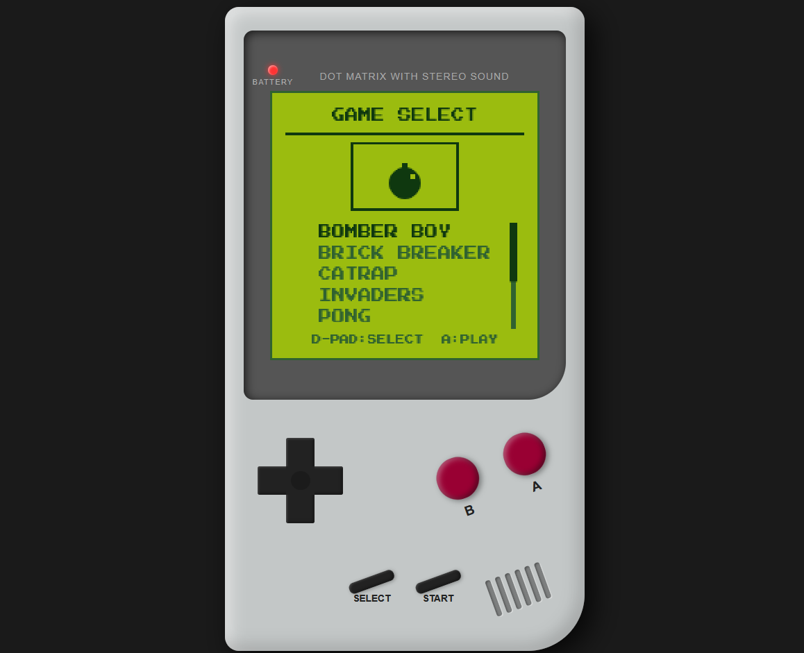

<div align="center">

# 👾 GAME BOY OS 👾

<br>

<br>

[](https://vitejs.dev/)
[](https://developer.mozilla.org/en-US/docs/Web/JavaScript)
[](https://developer.mozilla.org/en-US/docs/Web/HTML)
[](https://github.com/ellerbrock/open-source-badges/)

**A modern, lightweight, high-performance web-based simulation of a classic handheld system, featuring a growing collection of nostalgic games built from scratch.**

</div>

---

## 📱 Mobile Experience

Game Boy OS is fully responsive and supports touch controls out of the box! For the most immersive retro experience:
- Open the application on your mobile device.
- You can play in both **Upright (Portrait)** or **Landscape** orientations.
- The UI scales beautifully to match the screen, simulating a real handheld console right in your hands!

---

## 🎨 The 8-Bit Palette

This project adheres to the classic 4-color dot-matrix palette for ultimate nostalgia:

| Color Hex | Preview | Description |
| :---: | :---: | :--- |
| **`#0f380f`** | 🟩 | **Darkest Green** (Shadows & Outlines) |
| **`#306230`** | 🫑 | **Dark Green** (Mid-tones) |
| **`#8bac0f`** | 🥬 | **Light Green** (Highlights) |
| **`#9bbc0f`** | 🍐 | **Lightest Green** (Background) |

---

## 🕹️ Controls & Key Bindings

You can customize all keys in the UI by clicking the **KEY BINDINGS** button at the top of the screen!

| Action | Game Boy Button | Default Keyboard Key |
|---|---|---|
| **Move Up** | `▲` D-Pad Up | `ArrowUp` |
| **Move Down** | `▼` D-Pad Down | `ArrowDown` |
| **Move Left** | `◀` D-Pad Left | `ArrowLeft` |
| **Move Right** | `▶` D-Pad Right | `ArrowRight` |
| **Action A** | `(A)` | `z` |
| **Action B** | `(B)` | `x` |
| **Start** | `START` | `Enter` *(Play / Start game)* |
| **Select** | `SELECT` | `Shift` *(Exit to Menu / Reset)* |

---


## 💾 Games Catalog

Our custom cartridge includes **a growing collection of fully playable games**. Select them from the OS Menu!

| | Title | Genre | Description |
|---|---|---|---|
| 🧱 | **T2 (Tetris 2)** | Puzzle | Fall and fit blocks together in classic puzzle fashion. |
| 🐱 | **Catrap** | Logic | Re-imagination of the vintage Game Boy puzzle mechanic. |
| 🛸 | **Invaders** | Arcade | A fast-paced space defense shooter. |
| 🐍 | **Snake** | Arcade | Guide the snake, consume food, avoid yourself. |
| 🪂 | **Skydive** | Action | Free fall downward, avoiding obstacles on your way down. |
| 🏓 | **Pong** | Sports | Simple AI-driven paddle tennis simulation. |
| 💥 | **Brick Breaker**| Arcade | Retro brick deflection layout with bounce physics. |
| ⚔️ | **Tale of Orb** | RPG | A complete RPG adventure with dungeon grids. |
| 💣 | **Bomber Boy** | Action | Maze exploration with strategic bomb placement. |

---

## 🏗️ Internal Circuitry (Architecture)

```text
game-boy-os/
├── index.html          # Web page entry containing the Game Boy frame (Canvas)
├── src/
│   ├── main.js         # Core loop, OS boot-loader, and system-level routing
│   ├── style.css       # Retro custom styles (rotation, gamepad toggle, overlays)
│   ├── engine/         # System display & input managers
│   │   ├── display.js  # Screen orientation and rendering setups
│   │   ├── input.js    # Keyboard binding handlers & virtual gamepad events
│   │   └── state.js    # Global configurations, shapes/text draw tools
│   └── games/          # Game cartridges folder 
│       ├── index.js    # Aggregates and exports the active games array
│       └── [game].js   # Isolated game logic files
```

---


## 🤝 How to Contribute (Beginner Friendly!)

We welcome developers of all skill levels! Whether you want to add a new game, fix a bug, or improve documentation, here's how you can get started:

### 🚀 1. Boot Sequence (Local Setup)

To run the project locally, make sure you have [Node.js](https://nodejs.org) installed.

1. **Fork the Repository**: Click the "Fork" button at the top right of this page to create your own copy of the project.
2. **Clone your Fork**: Download your copy to your local machine and navigate into the folder:
   ```bash
   git clone https://github.com/YOUR_USERNAME/game-boy-os.git
   cd game-boy-os
   ```
3. **Insert Batteries (Install Dependencies)**: Install the necessary dependencies:
   ```bash
   npm install
   ```
4. **Flick the Switch (Run Local Dev Server)**: Start the local development server to test changes in the browser:
   ```bash
   npm run dev
   ```
   Open [http://localhost:5173](http://localhost:5173) in your browser.
5. **Burn the ROM (Build for Production)**: Build the application to verify compiling works:
   ```bash
   npm run build
   ```
   This produces a highly compressed and minified production build in the `dist/` directory.

### 🛠️ 2. DevKit: Add Your Own Game

Game Boy OS is fully open-source! Want to make a new game? Follow these steps:

#### Step 1: Create a Branch
Make a new branch for your game or fix:
```bash
git checkout -b my-new-game-or-feature
```

#### Step 2: Create your game cartridge
Create a new file: `src/games/my_cool_game.js`

#### Step 3: Implement the Game Blueprint
Every game must export a standard object. Here is the exact template:

```javascript
import { M, ctx, C0, C1, C2, C3, txt, fr, sr, state } from '../engine/state.js';

export const MyCoolGame = {
    // 1. Name of the game (displayed in the menu list)
    n: "MY COOL GAME",

    // 2. Setup initial variables
    ini() {
        this.score = 0;
        this.playerX = 100;
    },

    // 3. Update game ticks (dt = delta time in milliseconds)
    upd(dt) {
        if (state.k.L) this.playerX -= 0.1 * dt;
        if (state.k.R) this.playerX += 0.1 * dt;
    },

    // 4. Handle menu/input button down presses
    inp(btn) {
        if (btn === 'A') { /* Do action */ }
    },

    // 5. Draw elements on the screen (200x200 canvas)
    drw() {
        txt("SCORE: " + this.score, 10, 20, 8, 'left');
        fr(this.playerX, 150, 16, 16, C0); // Draw player block
    },

    // 6. Draw a custom 80x50 retro thumbnail art for the main menu
    art(x, y, w, h) {
        fr(x, y, w, h, C3); // Draw border/background
        sr(x, y, w, h, C0);
        txt("COOL", x + w/2, y + h/2, 10, 'center');
    }
};
```

#### Step 4: Register your game
Open `src/games/index.js` and add your game to the export list:

```diff
+import { MyCoolGame } from './my_cool_game.js';

-export const GL = [T2, CR, IV, SN, SD, PG, BB, RP, BM];
+export const GL = [T2, CR, IV, SN, SD, PG, BB, RP, BM, MyCoolGame];
```

The Game Boy OS menu automatically registers, sorts, and renders your game to the select list!

### 📥 3. Submit Your Contribution

Once your changes are tested and complete:

1. **Commit and Push**: Save your changes and push them to your fork:
   ```bash
   git commit -am "Added my cool feature"
   git push origin my-new-game-or-feature
   ```
2. **Open a Pull Request**: Go back to the main repository on GitHub and click "New Pull Request" to submit your work for review.

If you get stuck, feel free to open an issue and ask for help. We are happy to guide you!

---

## 📄 License

This project is **100% Free and Open-Source**. 

It is distributed under the [MIT License](LICENSE), which means you can use it, modify it, and share it freely without any cost. See the `LICENSE` file for more details.

---

<div align="center">
    <b>Have fun, stay nostalgic, and happy hacking! 👾</b><br>
    <i>If you build a cool game, open a Pull Request!</i>
</div>
